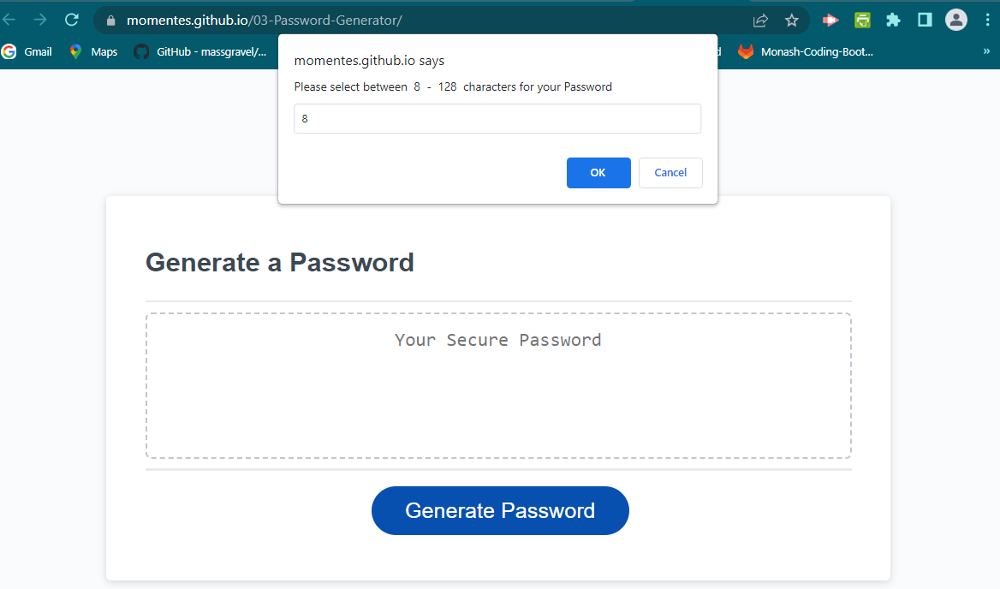

# Module-03-Challenge
Bootcamp Module 03 Challenge - Password Generator

This assignment is to modify starter code to create an application that enables employees to generate random passwords based on criteria that they’ve selected. Note : several deployed projects is a minimum requirement to receive an initial interview at many companies

**The acceptance criteria is as follow :**
- GIVEN I need a new, secure password
- WHEN I click the button to generate a password
- THEN I am presented with a series of prompts for password criteria
- WHEN prompted for password criteria
- THEN I select which criteria to include in the password
- WHEN prompted for the length of the password
- THEN I choose a length of at least 8 characters and no more than 128 characters
- WHEN asked for character types to include in the password
- THEN I confirm whether or not to include lowercase, uppercase, numeric, and/or special characters
- WHEN I answer each prompt
- THEN my input should be validated and at least one character type should be selected
- WHEN all prompts are answered
- THEN a password is generated that matches the selected criteria
- WHEN the password is generated
- THEN the password is either displayed in an alert or written to the page

**Creator Note:**
1. Project was done while limited internet connectivity was available.
2. Thank goodness for week 6 learning on preventdefault() JS
3. Below is an example of the website ;

**Credits for References & Learning Resources:**
1. Website Credits - W3schools
2. Website Credits - StackOverFlow
3. Website Credits - Markdownguide.org
4. Website Credits - https://dev.to/code_mystery/random-password-generator-using-javascript-6a

This project is for Private use/learning classes and not for commerical or public consumption.

Thank you
End.        

